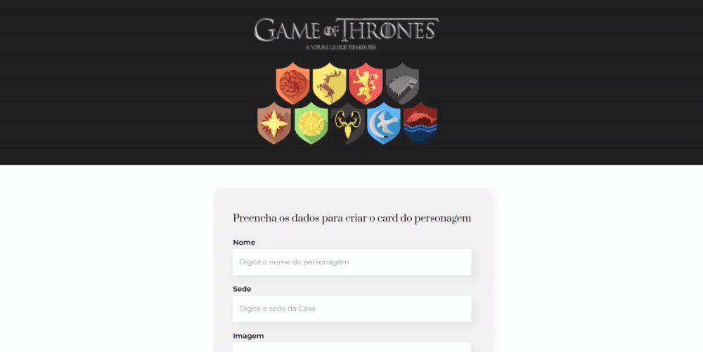

# Organo

Hi! This is a project developed with the intention to practicing React.js

Nice things that could be learned from this project:

-   Create a React project using [npm create-react-app](https://reactjs.org/docs/create-a-new-react-app.html);
- React.js Functional Components;
- React useState Hook;
- React condicional rendering;
- React composing components;
- React handling events;
- Javascript Array.map( ) and Array.filter( );
- List and keys;
- Forms.

---
## 📱Behavior



---

## 🚀 Technologies

This project was developed using the following technologies:

<a href='https://developer.mozilla.org/pt-BR/docs/Web/HTML' target="_blank">
</a>

<a href='https://developer.mozilla.org/pt-BR/docs/Web/CSS' target="_blank">
</a>

<a href='https://developer.mozilla.org/en-US/docs/Web/JavaScript' target="_blank">
</a>

<a href='https://reactjs.org/' target="_blank">
</a><br>
<a href='https://git-scm.com/doc' target="_blank">
</a>


---

## 📋 References 

- [Figma prototype](https://www.figma.com/file/QZ9B32bjz7KdFsEONpZj7H/Organo-Project?node-id=134%3A128&t=paS0yqaz9sJiBT6c-1)
- [Website](https://organo-gamma-lime.vercel.app/)

---

##  ⚠️ Dependencies

Before you begin, you will need to have the following tools installed on your machine: [Git] ([https://git-scm.com](https://git-scm.com/)), [Node.js] ([https://nodejs.org/en/](https://nodejs.org/en/)). In addition, it is good to have an editor to work with the code like [VSCode] ([https://code.visualstudio.com/](https://code.visualstudio.com/))

---

## 📥 # Installation and usage

```bash

# Clone this repository
$ git clone https://github.com/pmagalhaes2/organo.git

# Access the project folder in your terminal
$ cd organo

# Install the dependencies
$ npm install

# Run the application in development mode
$ npm run start

# The application will open on the port: 3000 - go to http://localhost:3000

```


---


Made by Patricia Magalhães 💙